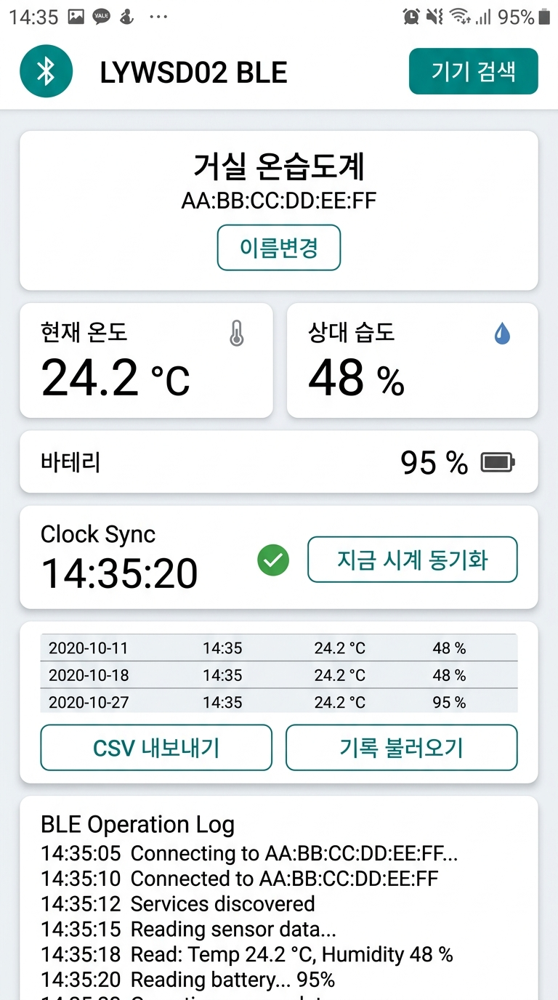

# 📡 LYWSD02 BLE Tool (Android) 🌡️

<p align="center">
  <strong>Native Android application for Xiaomi Mijia LYWSD02 Bluetooth Temperature & Humidity Clock</strong><br>
  <a href="#korean-한국어">한국어</a> · <a href="#english">English</a>
</p>

<p align="center">
  
</p>

---

<a id="korean-한국어"></a>
## 🇰🇷 한국어 설명

Xiaomi Mijia **LYWSD02** (및 LYWSD02MMC) 블루투스 온습도 시계를 안드로이드 스마트폰에서 실시간으로 모니터링하고 시계 및 설정을 제어할 수 있는 네이티브 안드로이드 앱입니다.

### ✨ 주요 기능

| 기능 | 설명 |
| :--- | :--- |
| ⏰ **시계 동기화** | 스마트폰의 정확한 시간 및 타임존으로 센서 시계를 1초 단위로 완벽하게 동기화합니다. 연결 시 10초 이상 드리프트가 감지되면 자동 보정합니다. |
| ⚙️ **디스플레이 설정** | 섭씨(°C) / 화씨(°F) 온도 단위를 기기에 영구 저장하며, 12시간 / 24시간 표시 형식을 설정합니다. |
| 🌡️ **실시간 센서 모니터링** | 실시간 온도, 습도, 배터리 잔량을 직관적인 게이지 카드와 함께 스트리밍으로 수신합니다. |
| 📊 **과거 기록 및 CSV 내보내기** | 센서 내장 메모리에 저장된 시간별 최고/최저 온습도 기록(최대 96개)을 불러와 조회하고 CSV 파일로 공유합니다. |
| 🏷️ **기기 관리 및 별칭** | '거실', '안방' 등 기기별 별칭을 부여하고, 최근 연결 목록에서 탭 한 번으로 즉시 재연결합니다. |
| 📋 **라이트 테마 이벤트 로그** | BLE 통신 상태, 패킷 수신 내역, 성공/경고/오류 상태를 실시간 로그로 투명하게 보여줍니다. |

---

<a id="english"></a>
## 🇺🇸 English Description

A native Android application designed to monitor and configure your Xiaomi Mijia **LYWSD02** (and LYWSD02MMC) Bluetooth Low Energy (BLE) temperature and humidity clock in real time with a crisp, high-contrast light UI.

### ✨ Key Features

| Feature | Description |
| :--- | :--- |
| ⏰ **Clock Synchronization** | Perfectly synchronizes sensor time down to the second with smartphone time and timezone offset. Features automatic clock drift calibration when drift exceeds 10 seconds. |
| ⚙️ **Display & Unit Settings** | Permanently save Celsius (°C) / Fahrenheit (°F) display preferences directly into device flash, and toggle between 12-hour and 24-hour display modes. |
| 🌡️ **Real-Time Sensor Monitoring** | Live streaming of ambient temperature, relative humidity, and battery percentage with animated gauge progress bars. |
| 📊 **Historical Records & CSV Export** | Fetch up to 96 hours of hourly min/max temperature & humidity statistics from internal sensor memory and export/share via CSV. |
| 🏷️ **Device Management & Aliases** | Assign friendly names (e.g., 'Living Room', 'Bedroom') to sensors and quickly reconnect with a single tap from recent devices. |
| 📋 **Light Theme Event Console** | Diagnostic console showing real-time BLE packet reception, synchronization events, and connection status in high contrast. |

---

## 🛠️ 기술 스택 및 빌드 (Tech Stack & Build)

- **Language**: Kotlin 2.3.20 (Toolchain Java 17)
- **UI Framework**: Jetpack Compose, Material 3
- **Architecture**: MVVM + Clean Architecture, Coroutines Flow
- **Min SDK**: Android 7.0 (API 24) / **Target SDK**: Android 16 (API 36)
- **Permissions**: Full Android 12+ runtime BLE permission handling (`BLUETOOTH_SCAN`, `BLUETOOTH_CONNECT`)

```bash
# Debug APK Build
./gradlew assembleDebug

# Run Unit Tests
./gradlew testDebugUnitTest
```

---

## 📜 출처 및 라이선스 (Attribution & License)

- 본 프로젝트는 [drslid/LYWSD02_BLE_Dashboard](https://github.com/drslid/LYWSD02_BLE_Dashboard) 웹 프로젝트의 BLE 통신 프로토콜 및 UI 디자인 컨셉을 기반으로 안드로이드 네이티브 앱으로 재구현되었습니다.
- Re-implemented natively based on the BLE protocol and UI concept of [drslid/LYWSD02_BLE_Dashboard](https://github.com/drslid/LYWSD02_BLE_Dashboard).
- License: **GNU General Public License v3.0 (GPL-3.0)**
